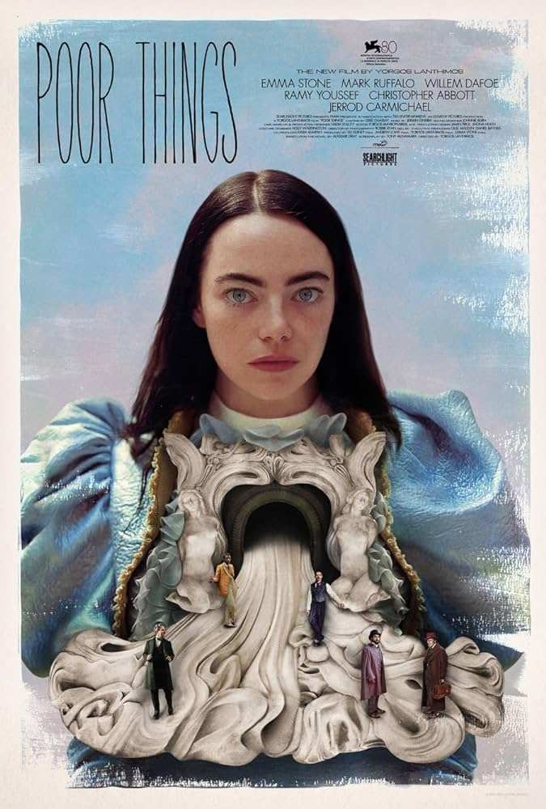

>“Do you think my father could have branded me with hot irons on the genitals the way he did if he could not put Science and Progress first!?”

This movie exceeded my expectations in many ways. I strongly dislike some of Yorgos Lanthimos’ movies (The Lobster, Killing of a Sacred Deer) and love others (The Favourite, Dogtooth). His unique satirical edge finds it’s most effective application to date in this fantasy odyssey which pits an otherworldly developing mind against a world of normativity. It earns every minute of it’s 141 minute runtime with gorgeous, colorful set pieces reminiscent of Terry Gilliam in his prime. Although full of sexually graphic scenarios, the film is not at all erotic but instead a ceaseless philosophical inquiry. Delightful, if you can stomach it.
