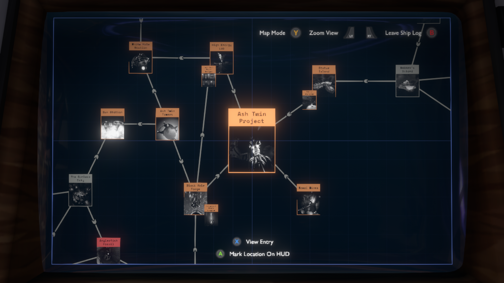
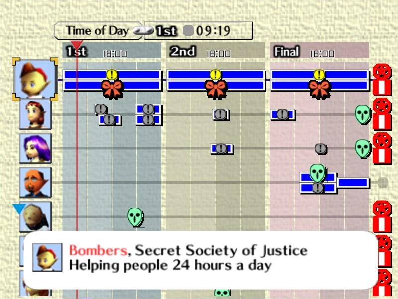

#lore 

The TORUS is a personal data bracelet shaped like a torus (donut) which is worn on the wrist and connects to a personal tablet for interface. The TORUS uses special biorhythmic sensors to track Marina's biometric data and upload it to the base's TORUS network, where all data is collected and collated by the [Information Science Team](InfoDept.md). The Torus Tablet contains a menu enabling exploration of Marina's [inventory](Inventory.md), a [live map](LiveMap.md) of Ares-622, information gleaned from Marina's past encounters, Marina's health status and more. Furthermore, the TORUS can be used to run open source applications shared amongst the colonists. Applications have a wide range of uses, from conducting interviews to hacking digital interfaces.

## TORUS Applications

*Genecoin*

  A cryptocurrency created by [Gene](Gene.md). Genecoins can be earned by playing minigames and traded with certain characters for special items and information. This app is invaluable to the player who wants to acquire every item in the game or bribe their way to the surface.

*Chain a.k.a. The Causal Chain*

  An application for amatuer sleuths, Chain automatically collates information of interest into a mind map that helps the player make sense of various events and questlines. Chain also offers Protips such as who the player should interview next and suggest the significance of found items. This app is invaluable to the player who wants to understand everything they hear.

*Freewily a.k.a. Free_Willy*

  Inspired by the real-life [hacker tool named after a sea mammal](https://flipperzero.one/), the Freewily endows Marina's TORUS to copy fob keys, steal passcodes, infiltrate databases and generally break all the rules. This app is invaluable to the player who wants to gain unrestricted access to Ares-622, by any means necessary.

*Echolalia*

  This is the only social media app permitted on Ares-622. It is admittedly full of useless posting and insincere claims, but it may prove useful for tracking down rumors and hearsay. This app is invaluable to the player who wants to know what everyone on Ares-622 is thinking about (not recommended).

*Reachr*

  This is the official fitness app for Ares-622. Use it anywhere, anytime to get a quick, guided stretch in (minigame). Stretching takes about 5 minutes (20 minutes gametime), but it increases Marina's movement speed for the remainder of the day.

*Clearly*

  Ares-622's mental wellness app, inspired by CBT self-help apps like Calm. Journal Marina's feelings everyday by selecting words from a list that describe your mood. Feels kind of pointless, but regular use of Clearly has been shown in case studies to alleviate social anxiety and increase dialogue options.

## Namesake

A Torus is a doughnut-shaped surface generated by a circle rotated about an axis in its plane that does not intersect the circle. In other words, a 3d ring. Notably, the innermost and outermost point of the Torus are on the same continuous surface. The TORUS device gets it's name from this shape because it simultaneously collects data from inside and outside the subject in order to inform the user of their condition and advise them.
  
## Inspiration for the Torus menu(s):

In *13 Sentinels: Aegis Rim*, dialogue is carried out using a word cloud, allowing the player to click a category in order to question an NPC about it. This creates new content with each character each time a new topic is discovered. The word cloud is also used to depict the character's inventory.

In *The Outer Wilds*, a computer log automatically maps information gleaned from your surroundings to an infographic which informs your further exploration.

In Majora's Mask, the 'Bombers Journal' is used to track the daily activities of quest-relevant NPCs and their desires.

In *Silent Hill 2*, handwritten amendments are automatically made to the map to signify dead ends and landmarks which are discovered along the way.
*[Return to Index](index2.md)*
